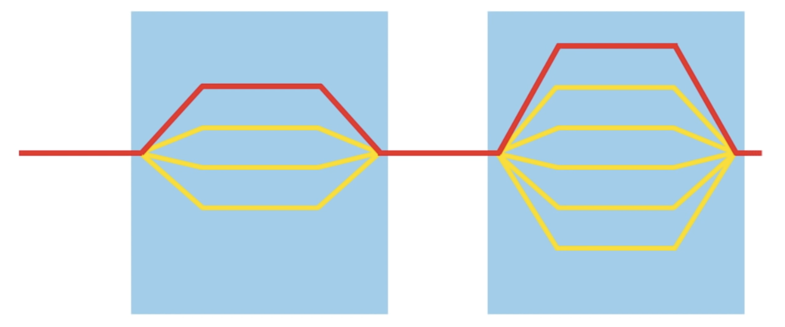

<style>
table {
margin: auto;
}
</style>
# Shared Address Based Architecture: SMP & NUMA
## Symmetric Multiprocessing
In SMP systems, multiple processors are connected to a single shared memory system. All processors have equal access to the shared memory, which means that any processor can access any memory location without any significant difference in memory access time. This symmetric access pattern is the key characteristic of SMP. Some other key points are as following:
- SMP systems typically have a small number of processors, ranging from a few to a couple of dozen.
- The processors in SMP are usually identical in terms of architecture and capabilities.
- SMP systems operate under a single operating system, and the workload is evenly distributed among the processors.
- The shared memory allows processes or threads running on different processors to communicate with each other efficiently.
- SMP systems are designed to provide high throughput and parallel processing capabilities, which are suitable for a wide range of applications.
## Non-Uniform Memory Access
NUMA is an architecture where multiple processors are connected to a system that consists of several memory modules. In a NUMA system, each processor has its own local memory (referred to as local memory nodes), and it can also access the remote memory nodes attached to other processors over a shared interconnect. Some key points are as following:
- NUMA systems can have a larger number of processors compared to SMP systems, ranging from several dozen to hundreds or even thousands.
- Processors in NUMA systems can have different capabilities and may not be identical.
- NUMA systems are designed to optimize memory access by reducing latency. Local memory access is faster than accessing remote memory.
- Each processor in a NUMA system has faster access to its own local memory and slower access to remote memory.
- NUMA systems are commonly used in large-scale servers or high-performance computing environments where memory access latency can significantly impact performance.
## Differences between SMP and NUMA
1.  Memory Access: In SMP, all processors have equal and symmetric access to the shared memory. In NUMA, each processor has its own local memory, and accessing local memory is faster than accessing remote memory.
    
2.  Scalability: SMP systems typically have a smaller number of processors, while NUMA systems can scale to a larger number of processors.
    
3.  Processor Similarity: In SMP, the processors are generally identical in terms of architecture and capabilities. In NUMA, processors can have different capabilities and may not be identical.
    
4.  Memory Latency: NUMA systems are designed to reduce memory access latency by providing faster access to local memory. SMP systems do not differentiate memory access based on locality.
    
5.  Workload Distribution: In SMP, the workload is evenly distributed among all processors. In NUMA, workload distribution can be optimized to minimize remote memory accesses and reduce latency.

## Others
There are other architectural models where processors do not share a common address space. Here are a few examples:

1.  Distributed Memory Architecture: In this model, each processor has its own private memory, and there is no shared memory accessible by all processors. To communicate or share data, explicit message passing is required between processors. Examples of distributed memory architectures include clusters and massively parallel processing (MPP) systems.
    
2.  Hybrid Architectures: Some systems combine shared memory and distributed memory models. These hybrid architectures have a combination of shared-memory nodes and distributed-memory nodes. The shared-memory nodes typically follow SMP or NUMA architectures, while the distributed-memory nodes communicate through message passing. Examples include systems like heterogeneous clusters or hybrid supercomputers.
    
3.  SIMD (Single Instruction, Multiple Data): SIMD architectures execute the same instruction on multiple data elements simultaneously. They often feature a single control unit (processor) that broadcasts instructions to multiple processing units (vector processors) that operate on different data elements. In SIMD architectures, the processors do not share a common address space.
    
4.  MIMD (Multiple Instruction, Multiple Data): MIMD architectures encompass systems where multiple processors independently execute different instructions on different data sets. Examples of MIMD architectures include clusters, grid computing, and multi-computer systems. In these architectures, processors typically have their own memory and do not share a common address space.
# OpenMP Overview
- OpenMP is a multi-threading, shared address model.
- Threads communicate by sharing variables.
- Unintended sharing of data causes ***race conditions***.
- Race Condition: when the program’s outcome changes as the threads are scheduled differently.
- To control race conditions, use ***synchronization*** to protect data conflicts, which is expensive.
## Example 1
```cpp
#include<stdio.h>
#include"omp.h"
int main()
{
    #pragma omp parallel
    {
      int ID = omp_get_thread_num();
      printf("hello(%d)", ID);
      printf("world(%d)\n", ID);
    }
} 
```
# Fork-join Parallelism

Fork-join parallelism is a programming model and execution pattern that allows for the efficient execution of parallel tasks. It consists of two main phases: the "fork" phase and the "join" phase.
1.  Fork Phase: In the fork phase, a task or a computation is divided into smaller subtasks, creating a parallel execution hierarchy. Each subtask is assigned to a separate thread or worker, and these threads execute their respective subtasks concurrently. This phase is called "fork" because the parent task spawns multiple child tasks, creating a parallel execution flow.
2.  Join Phase: In the join phase, the threads or workers wait for their subtasks to complete. Once all the subtasks have finished executing, the threads synchronize and join together, consolidating the results of their computations. This synchronization point ensures that all subtasks have completed before proceeding further. This phase is called "join" because the parallel execution flow is consolidated back into a single flow.

The fork-join parallelism model is often implemented using parallel programming frameworks or APIs such as OpenMP, Java's Fork/Join framework, or the Cilk programming language.

## Example2
```cpp
#include<stdio.h>
#include"omp.h"
#define NUM_THREADS 4
static long num_steps = 10000000;
double dx;

int main()
{
  int i, nthreads;
  long double pi, sum[NUM_THREADS];
  long double start_time, end_time;
  dx = 1.0 / (long double) num_steps;
  omp_set_num_threads(NUM_THREADS);
  start_time = omp_get_wtime();
#pragma omp parallel
  {
    int i, id;
    long double x;
    id = omp_get_thread_num();
    nthreads = omp_get_num_threads();
    for (i = id, sum[id] = 0.0; i < num_steps; i = i+nthreads)
    {
      x = (i + 0.5) * dx;
      sum[id] += 4.0 / (1.0 + x*x);
    }
  }
  for (i = 0,pi = 0.0; i < NUM_THREADS; i++) pi += sum[i] * dx;
  end_time = omp_get_wtime();
  printf("The numerical integration of pi is %.10Lf.\n", pi);
  printf("Execution time: %Lf seconds.", end_time - start_time);
  return 0;
} 
```
# False Sharing
False sharing is a phenomenon that occurs in parallel programming when multiple threads or processors inadvertently share the same cache line, resulting in performance degradation. It is a performance issue rather than an actual sharing of data.

In modern computer architectures, the memory system is typically organized into cache lines. A cache line is a fixed-size block of memory (e.g., 64 bytes) that is loaded from main memory into the cache. When a processor accesses a memory location, it brings the entire cache line containing that location into its local cache.

False sharing arises when multiple threads or processors access different variables that happen to reside on the same cache line. Even though these variables are logically distinct and unrelated, the sharing of the cache line causes unnecessary cache invalidations and coherence traffic between the processors, degrading performance.

False sharing can significantly impact performance, as it introduces cache contention and increases memory access latency. It is particularly problematic in parallel applications where multiple threads or processors frequently access shared data.

Mitigating false sharing typically involves techniques such as:

- Padding: Inserting additional padding or dummy variables to separate variables that are prone to false sharing, ensuring they reside on different cache lines.
- Thread/Processor Affinity: Assigning threads or processors to specific cores or sockets, reducing the chances of false sharing due to cache line conflicts.
- Data Replication: Making copies of data to ensure each thread or processor works on its private copy, eliminating sharing and false sharing altogether.
- Compiler and Language Optimizations: Compiler optimizations and programming techniques, such as thread-local storage or data alignment directives, can help mitigate false sharing.

Detecting false sharing requires careful performance profiling, monitoring cache behavior, and examining cache coherence traffic. Specialized profiling tools and performance counters provided by the system or development environments can assist in identifying false sharing issues.

In example2, I also use `omp_get_time()` to output the time of running codes in order to reveal the fact of false sharing, here is the results of using different number of threads:

<!-- 让表格居中显示的风格 -->
<style>
.center 
{
  width: auto;
  display: table;
  margin-left: auto;
  margin-right: auto;
}
</style>

<div class="center">

| Number of Threads  | Consuming Time (s)|
| :---: | :---: | 
|  1   |   0.025067   |
|   2   |   0.013962   |
|   4  |   0.007185  |
|8     |    0.005292    |
|16 | 0.004983|
</div>

The time consuming can’t decrease linearly as the number of threads gets larger.


