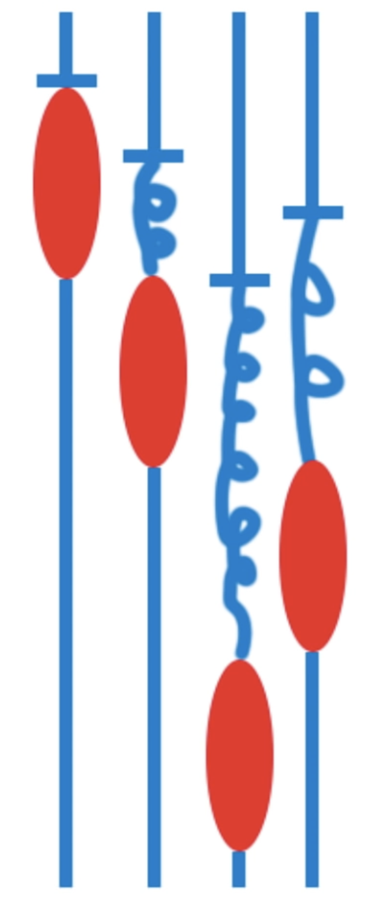

# 

Shared Address Based Architecture: SMP & NUMA

## Symmetric Multiprocessing
In SMP systems, multiple processors are connected to a single shared memory system. All processors have equal access to the shared memory, which means that any processor can access any memory location without any significant difference in memory access time. This symmetric access pattern is the key characteristic of SMP. Some other key points are as following:
- SMP systems typically have a small number of processors, ranging from a few to a couple of dozen.
- The processors in SMP are usually identical in terms of architecture and capabilities.
- SMP systems operate under a single operating system, and the workload is evenly distributed among the processors.
- The shared memory allows processes or threads running on different processors to communicate with each other efficiently.
- SMP systems are designed to provide high throughput and parallel processing capabilities, which are suitable for a wide range of applications.
## Non-Uniform Memory Access
NUMA is an architecture where multiple processors are connected to a system that consists of several memory modules. In a NUMA system, each processor has its own local memory (referred to as local memory nodes), and it can also access the remote memory nodes attached to other processors over a shared interconnect. Some key points are as following:
- NUMA systems can have a larger number of processors compared to SMP systems, ranging from several dozen to hundreds or even thousands.
- Processors in NUMA systems can have different capabilities and may not be identical.
- NUMA systems are designed to optimize memory access by reducing latency. Local memory access is faster than accessing remote memory.
- Each processor in a NUMA system has faster access to its own local memory and slower access to remote memory.
- NUMA systems are commonly used in large-scale servers or high-performance computing environments where memory access latency can significantly impact performance.
## Differences between SMP and NUMA
1.  Memory Access: In SMP, all processors have equal and symmetric access to the shared memory. In NUMA, each processor has its own local memory, and accessing local memory is faster than accessing remote memory.
    
2.  Scalability: SMP systems typically have a smaller number of processors, while NUMA systems can scale to a larger number of processors.
    
3.  Processor Similarity: In SMP, the processors are generally identical in terms of architecture and capabilities. In NUMA, processors can have different capabilities and may not be identical.
    
4.  Memory Latency: NUMA systems are designed to reduce memory access latency by providing faster access to local memory. SMP systems do not differentiate memory access based on locality.
    
5.  Workload Distribution: In SMP, the workload is evenly distributed among all processors. In NUMA, workload distribution can be optimized to minimize remote memory accesses and reduce latency.

## Others
There are other architectural models where processors do not share a common address space. Here are a few examples:

1.  Distributed Memory Architecture: In this model, each processor has its own private memory, and there is no shared memory accessible by all processors. To communicate or share data, explicit message passing is required between processors. Examples of distributed memory architectures include clusters and massively parallel processing (MPP) systems.
    
2.  Hybrid Architectures: Some systems combine shared memory and distributed memory models. These hybrid architectures have a combination of shared-memory nodes and distributed-memory nodes. The shared-memory nodes typically follow SMP or NUMA architectures, while the distributed-memory nodes communicate through message passing. Examples include systems like heterogeneous clusters or hybrid supercomputers.
    
3.  SIMD (Single Instruction, Multiple Data): SIMD architectures execute the same instruction on multiple data elements simultaneously. They often feature a single control unit (processor) that broadcasts instructions to multiple processing units (vector processors) that operate on different data elements. In SIMD architectures, the processors do not share a common address space.
    
4.  MIMD (Multiple Instruction, Multiple Data): MIMD architectures encompass systems where multiple processors independently execute different instructions on different data sets. Examples of MIMD architectures include clusters, grid computing, and multi-computer systems. In these architectures, processors typically have their own memory and do not share a common address space.
# OpenMP Overview
- OpenMP is a multi-threading, shared address model.
- Threads communicate by sharing variables.
- Unintended sharing of data causes ***race conditions***.
- Race Condition: when the program’s outcome changes as the threads are scheduled differently.
- To control race conditions, use ***synchronization*** to protect data conflicts, which is expensive.
## Example 1
```c#
#include<stdio.h>
#include"omp.h"
int main()
{
    #pragma omp parallel
    {
      int ID = omp_get_thread_num();
      printf("hello(%d)", ID);
      printf("world(%d)\n", ID);
    }
} 
```
# Fork-join Parallelism

Fork-join parallelism is a programming model and execution pattern that allows for the efficient execution of parallel tasks. It consists of two main phases: the "fork" phase and the "join" phase.

1.  Fork Phase: In the fork phase, a task or a computation is divided into smaller subtasks, creating a parallel execution hierarchy. Each subtask is assigned to a separate thread or worker, and these threads execute their respective subtasks concurrently. This phase is called "fork" because the parent task spawns multiple child tasks, creating a parallel execution flow.
2.  Join Phase: In the join phase, the threads or workers wait for their subtasks to complete. Once all the subtasks have finished executing, the threads synchronize and join together, consolidating the results of their computations. This synchronization point ensures that all subtasks have completed before proceeding further. This phase is called "join" because the parallel execution flow is consolidated back into a single flow.

The fork-join parallelism model is often implemented using parallel programming frameworks or APIs such as OpenMP, Java's Fork/Join framework, or the Cilk programming language.

## Example2

```c#
#include<stdio.h>
#include"omp.h"
#define NUM_THREADS 4
static long num_steps = 10000000;
double dx;

int main()
{
  int i, nthreads;
  long double pi, sum[NUM_THREADS];
  long double start_time, end_time;
  dx = 1.0 / (long double) num_steps;
  omp_set_num_threads(NUM_THREADS);
  start_time = omp_get_wtime();
#pragma omp parallel
  {
    int i, id;
    long double x;
    id = omp_get_thread_num();
    nthreads = omp_get_num_threads();
    for (i = id, sum[id] = 0.0; i < num_steps; i = i+nthreads)
    {
      x = (i + 0.5) * dx;
      sum[id] += 4.0 / (1.0 + x*x);
    }
  }
  for (i = 0,pi = 0.0; i < NUM_THREADS; i++) pi += sum[i] * dx;
  end_time = omp_get_wtime();
  printf("The numerical integration of pi is %.10Lf.\n", pi);
  printf("Execution time: %Lf seconds.", end_time - start_time);
  return 0;
} 
```
**Remark**: You need to manually assign each thread the number that needs to be executed in the loop, based on the index of threads. The ```long``` type  variable is used to output a more accurate execution time.

**Summary**: 
- Use ```include<omp.h> ``` to insert the library of *OpenMP*.
- Use ```omp_set_num_threads(NUM_THREADS);``` to set the number of threads.
- Use ```omp_get_threads_num();``` to get the *id* of threads.
- Use ```omp_get_num_threads();``` to get the *number* of threads.

# False Sharing

False sharing is a phenomenon that occurs in parallel programming when multiple threads or processors inadvertently share the same cache line, resulting in performance degradation. It is a performance issue rather than an actual sharing of data.

In modern computer architectures, the memory system is typically organized into cache lines. A cache line is a fixed-size block of memory (e.g., 64 bytes) that is loaded from main memory into the cache. When a processor accesses a memory location, it brings the entire cache line containing that location into its local cache.

False sharing arises when multiple threads or processors access different variables that happen to reside on the same cache line. Even though these variables are logically distinct and unrelated, the sharing of the cache line causes unnecessary cache invalidations and coherence traffic between the processors, degrading performance.

False sharing can significantly impact performance, as it introduces cache contention and increases memory access latency. It is particularly problematic in parallel applications where multiple threads or processors frequently access shared data.

Mitigating false sharing typically involves techniques such as:

- Padding: Inserting additional padding or dummy variables to separate variables that are prone to false sharing, ensuring they reside on different cache lines.
- Thread/Processor Affinity: Assigning threads or processors to specific cores or sockets, reducing the chances of false sharing due to cache line conflicts.
- Data Replication: Making copies of data to ensure each thread or processor works on its private copy, eliminating sharing and false sharing altogether.
- Compiler and Language Optimizations: Compiler optimizations and programming techniques, such as thread-local storage or data alignment directives, can help mitigate false sharing.

Detecting false sharing requires careful performance profiling, monitoring cache behavior, and examining cache coherence traffic. Specialized profiling tools and performance counters provided by the system or development environments can assist in identifying false sharing issues.

In example2, I also use `omp_get_time()` to output the time of running codes in order to reveal the fact of false sharing, here is the results of using different number of threads:


| Number of Threads  | Consuming Time (s) (Macbook Air)|Consuming Time (s) (Macbook Pro)|
| :---: | :---: | :---: |
|  1   |   0.025067   | 0.019296|
|   2   |   0.013962   | 0.010428|
|   4  |   0.007185  | 0.005739|
|8     |    0.005292    |0.003425|
|16 | 0.004983|0.003287|

The time consuming can’t decrease linearly as the number of threads gets larger.

## Example3 (way to solve *False Sharing*)
```c#
#include<stdio.h>
#include"omp.h"
#define NUM_THREADS 16
#define PAD 8 // assume 64 byte L1 cache line size
static long num_steps = 10000000;
double dx;

int main()
{
  int i, nthreads;
  long double pi, sum[NUM_THREADS][PAD];
  long double start_time, end_time;
  dx = 1.0 / (long double) num_steps;
  omp_set_num_threads(NUM_THREADS);
  start_time = omp_get_wtime();
#pragma omp parallel
  {
    int i, id;
    long double x;
    id = omp_get_thread_num();
    nthreads = omp_get_num_threads();
    for (i = id, sum[id][0] = 0.0; i < num_steps; i = i+nthreads)
    {
      x = (i + 0.5) * dx;
      sum[id][0] += 4.0 / (1.0 + x*x);
    }
  }
  for (i = 0,pi = 0.0; i < NUM_THREADS; i++) pi += sum[i][0] * dx;
  end_time = omp_get_wtime();
  printf("The numerical integration of pi is %.10Lf.\n", pi);
  printf("Execution time: %Lf seconds.", end_time - start_time);
  return 0;
} 
```
**Notes**: Use ```#define PAD 8``` to avoid the conflicts caused by different threads reading the same block of memory.
**Remark**: The method is ugly.

MacBook Pro CPU information:
	*machdep.cpu.cores_per_package: 12
	machdep.cpu.core_count: 12
	machdep.cpu.logical_per_package: 12
	machdep.cpu.thread_count: 12
	machdep.cpu.brand_string: Apple M2 Pro*

| Number of Threads  | Consuming Time (s) (Example3)|Consuming Time (s) (Example2)|
| :---: | :---: | :---: |
|  1   |   0.019267   | 0.019296|
|   2   |   0.010408   | 0.010428|
|   4  |   0.005772  | 0.005739|
|8     |    0.003344    |0.003425|
|16 | 0.003456|0.003287|

**Comment**: The example is too simple to demonstrate the effectiveness of CPU's advanced performance in resolving false sharing issues. Another reason is that , the device nowadays has large memory, and *Fasle Sharing* hardly happens when processing some simple data.

# Synchronization

- **Barrier Synchronization**: Each thread wait at the *barrier* until all threads arrive (left figure).

```c#
  #pragma omp parallel
  {
  	int id = omp_get_thread_num();
    A[id] = big_cal1(id); // big_cal1 is a function
    #pragma omp barrier
    B[id] = big_cal2(id,A);
  }
```

- **Mutual Exclusion Synchronization**: Define a block of code that only one thread at a time can execute (right figure).

  ```c#
  float res;
  #pragma omp parallel
  {
    float B; int i, id, num;
    id = omp_get_thread_num();
    num = omp_get_num_threads();
    for (i = id; i < niters; i+ = num)
    {
      B = big_job(i); // big job is executed in for-loop
      #pragma omp critical
      res += consume(B);
    }
  }```

​                                                   

- **Atomic Synchronization**: suitable for updating simple binary values, such as incrementing, or reading and writing a temporary value for updating.

  ```c
  #pragma omp parallel
  {
  	double tmp, B;
  	B = DOIT();
  	tmp = big_ugly(B);
  	#pragma omp atomic
  	X+ = tmp;
  }
  ```

***Notes***: The statement inside the atomic *must* be one of the following forms: ```x+ = expr```, ```x- = expr```, ```x++```, ```++x```, ```x--```, ```--x```.

## Example2_revised (Mutual Exclusion Synchronization)

```cpp
#include<stdio.h>
#include"omp.h"
#define NUM_THREADS 1
static long num_steps = 1000000;
double dx;

int main()
{
  int i, num_threads;
  long double pi = 0.0;
  long double sum;
  long double start_time, end_time;
  dx = 1.0 / (long double) num_steps;
  omp_set_num_threads(NUM_THREADS);
  start_time = omp_get_wtime();
	#pragma omp parallel
  {
    int id;
    long double x;
    id = omp_get_thread_num();
    num_threads = omp_get_num_threads();
    for (i = id, sum = 0.0; i < num_steps; i = i+num_threads)  
    {
      x = (i + 0.5) * dx;
      sum += 4.0 / (1.0 + x*x);
    }
    #pragma omp critical
    pi += sum * dx;
  }
  end_time = omp_get_wtime();
  printf("The numerical integration of pi is %.10Lf.\n", pi);
  printf("Execution time: %Lf seconds.", end_time - start_time);
  return 0;
}
```
# Worksharing

- Loop Construct
- Sections/Section Construct
- Single Construct
- Task Construct

## Loop Work Sharing

```c#
#pragma omp parallel
{
#pragma omp for
	for (i = 0; i < N; i++)
	{
		NEAT_STUFF(i);
	}
}
```

- **Static schedule**: one of the options available for loop work sharing. It determines how the iterations of a loop are divided among multiple threads in a parallel region.
  
  When using a static schedule, iterations of the loop are divided into chunks, and each thread is assigned a chunk of iterations to execute. The chunk size is typically determined based on the total number of loop iterations and the number of threads available.
  
  The key characteristic of the static schedule is that the iterations are assigned to threads in a *predetermined* and *fixed* order. The order is determined by the iteration index and the chunk size. The first thread is assigned the first chunk, the second thread gets the second chunk, and so on. This ensures that the workload is evenly distributed among the threads.
  
  Here's an example of using the static schedule in OpenMP:
  
  ```c#
  #include <omp.h>
  int main() {
    int i;
    int num_iterations = 100;
    #pragma omp parallel for schedule(static)
    for (i = 0; i < num_iterations; i++) {
        // Loop body
    }
    return 0;
  }
  
- **Dynamic schedule**:  another option for loop work sharing. It determines how loop iterations are divided among threads in a parallel region, similar to the static schedule. However, unlike the static schedule, the dynamic schedule assigns iterations to threads on-demand, rather than in a predetermined order.

  When using a dynamic schedule, the loop iterations are divided into chunks, and each thread is initially assigned a chunk of iterations. *When a thread finishes executing its assigned chunk, it requests another chunk from the remaining iterations*. This dynamic assignment of iterations continues until all iterations are completed.

  The dynamic scheduling policy offers load balancing and is useful when the iterations of the loop have varying execution times. It allows the threads to work on smaller chunks of iterations, which can help distribute the workload more evenly and prevent any single thread from being idle while others are still executing.

  Here's an example of using the dynamic schedule in OpenMP:
  
  ```c#
  #include <omp.h>
  int main() {
      int i;
      int num_iterations = 100;
      #pragma omp parallel for schedule(dynamic)
      for (i = 0; i < num_iterations; i++) {
          // Loop body
      }
      return 0;
  }
  
  ```
  
  Similar to the static schedule, you can also specify the chunk size explicitly using the `chunk` clause with the `schedule(dynamic, chunk_size)` syntax. By default, if the chunk size is not specified, the OpenMP runtime system determines a suitable value based on the number of threads and the total number of iterations. Also note that combined construct: `#pragma omp parallel` + `#parallel omp for` = `#parallel omp parallel for`.
  
## Working With Loops

- Find the *compute-intensive* loops.
  
- Make the loop iterations *independent* so they can safely execute in any order without loop-carried dependencies.
  
- Place the appropriate *OpenMP* directive and test.
  
  Here is an example:
  
  ```c#
  int i, j, A[MAX];
  j = 5;
  for (i = 0; i < MAX; i++)
  {
    j += 2;
    A[i] = big[j];
  }
  ```
  
  The example above cannot be executed with OpenMP loops for the loop body has dependencies each iteration. But we can remove that dependencies by redesign it:
  
  ```c#
   int i, j, A[MAX];
   #pragma omp parallel for
   for (i = 0; i < MAX; i++)
   {
     j = 5 + 2 * (i+1);
     A[i] = big[j];
   }
  ```
  
## Reduction operator

- reduction is a technique used to perform a parallel reduction operation on a shared variable. It allows multiple threads to independently compute partial results and then combine those results into a single value.

- Reduction operations are typically used to aggregate or combine values across iterations of a loop or other parallel constructs. Common reduction operations include summing elements, finding the maximum or minimum value, performing logical operations like bitwise OR or AND, and more.

- The OpenMP `reduction` clause provides a convenient way to specify reduction operations in parallel constructs, such as parallel loops (`parallel for`) or parallel sections (`parallel sections`). The `reduction` clause automatically handles the synchronization and reduction logic required to combine the partial results.

  Here's an example of using the `reduction` clause in OpenMP:

  ```c#
  #include <omp.h>
  
  int main() {
      int i;
      int sum = 0;
      int num_iterations = 100;
      
      #pragma omp parallel for reduction(+:sum)
      for (i = 0; i < num_iterations; i++) {
          sum += i;
      }
      printf("Sum: %d\n", sum);
      return 0;
  }
  ```

- In the example above, the `reduction(+:sum)` clause is added to the `parallel for` construct. It specifies that the reduction operation is addition (`+`) and the shared variable to be reduced is `sum`. Each thread works on a subset of loop iterations and accumulates its partial sum into the shared `sum` variable using the reduction operation (`+=`). After the parallel execution, the value of `sum` represents the sum of all loop iterations.
- OpenMP supports a variety of reduction operations, including arithmetic operations (`+`, `-`, `*`, `/`, etc.), logical operations (`&&`, `||`, `&`, `|`, `^`), and some predefined functions (`min`, `max`, etc.). You can choose the appropriate reduction operation based on the desired aggregation behavior.
- Using the `reduction` clause simplifies the process of parallelizing reduction operations, as it handles the necessary synchronization and reduction logic automatically. It allows you to write cleaner and more concise parallel code while achieving parallelism and aggregating results efficiently.
- **OpenMP: Reduction operands/initial-values**

| Operator |   Initial Value   |Operator|Initial Value|
| :---: | :---: | :---: | :---: |
|  +   |   0   | & |~0|
|   *   |   1   | \| |0|
|  -  |   0  | ^ |0|
| Min | *Largest pos num* | && |1|
| Max | *Most neg num* | \|\| |0|

The initial value of variable to be reduced is very important.